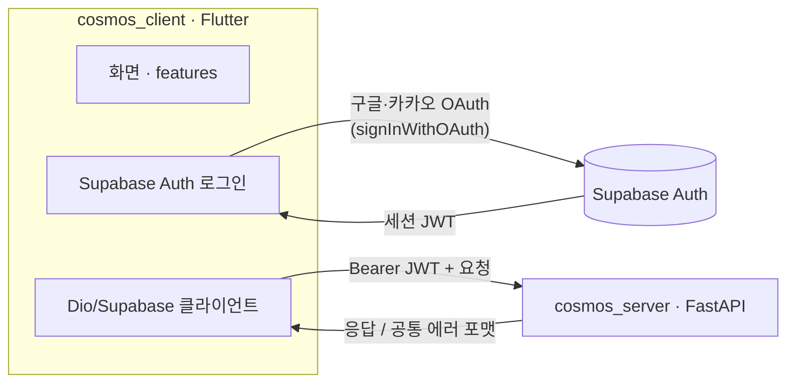
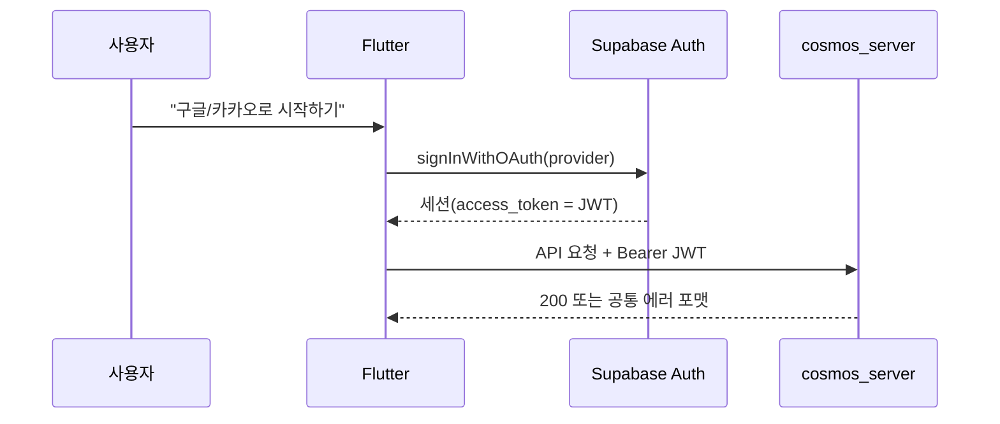

# 클라이언트 아키텍처

> 작성일: 2026-07-09 · 작성: 금별
>
> 대상: cosmos_client에 코드를 쓰는 프론트 팀원.
>
> 범위: 이 저장소(Flutter 앱)의 내부 구조. 상위 시스템 설계(서버·인프라 포함)는
> [시스템 아키텍처 설계서](https://app.notion.com/p/396d3e5629a4815d90a2c94743de8bb1)(Notion)가
> 진실 공급원이다. 서버 내부 구조는 [cosmos_server/docs/architecture.md](https://github.com/cosmos-incicrew/cosmos_server/blob/main/docs/architecture.md)를 따른다.

## 1. 개요

cosmos_client는 화장품 전성분 해설·2개 제품 교차 조회·BSTI 기반 성분 추천을 사용자에게
보여주는 Flutter 앱이다. **cosmos_server가 유일한 백엔드**이며, 앱은 화면·사용자 입력·
로그인(Supabase Auth)·서버 호출을 담당한다.

이 저장소가 책임지는 것과 책임지지 않는 것을 먼저 분명히 한다.

| 앱이 하는 일 | 앱이 하지 않는 일 |
|---|---|
| 화면·UI·사용자 입력 | 비즈니스 로직·데이터 조회 (서버가 담당) |
| Supabase Auth 로그인 → JWT 획득 | JWT 검증 (서버 `verify_jwt`가 담당) |
| 서버 API 호출(Bearer JWT) | LLM 호출·근거 기반 생성 (서버가 담당) |
| 로컬 캐시(최근 검색·조회 기록) | DB 스키마·RLS 정책 (서버·마이그레이션이 담당) |

## 2. 시스템 컨텍스트



핵심은 서버 문서와 동일하게 **인증의 두 경로**다. 사용자는 앱에서 **Supabase Auth로 직접
로그인**해 JWT를 받고, 그 JWT를 서버에 `Authorization: Bearer`로 전달한다. 앱은 소셜
로그인 SDK를 개별 연동하지 않고 **Supabase Auth OAuth(`signInWithOAuth`)로 통일**한다.
서버는 로그인을 처리하지 않고 검증만 한다.

## 3. 레이어 구조

의존은 항상 위에서 아래로만 흐른다. 아래 계층은 위 계층을 알지 못한다.

```
lib/main.dart                진입점 — Hive·Supabase 초기화 후 앱 실행
  │
  ├─ lib/app/                 앱 조립 — 테마·라우터(go_router)·루트 위젯
  │
  ├─ lib/features/<기능>/     기능. presentation → data (단방향)
  │                          기능끼리는 서로 import 하지 않는다 (규칙: conventions.md)
  │
  └─ lib/core/               공통 인프라. config·network·storage·widgets
```

- `presentation`(화면·위젯·provider)은 UI 관심사만, `data`(모델·repository)는 서버·저장소
  접근만 다룬다. 서버 문서의 `router → service → schemas` 단방향과 같은 사상이다.
- 한 기능이 다른 기능의 코드를 필요로 하면, 그 코드를 `core/`로 올린 뒤 양쪽이 참조한다.
  (서버의 `core/`·`common/` 승격 규칙과 동일)

## 4. 기능 구성

화면은 **피그마의 사용자 여정** 기준으로 묶고, 대응 서버 모듈을 함께 표기한다. 서버 도메인 용어
(BSTI·성분·추천)를 프론트에서도 그대로 쓴다 — 팀 소통과 API 매핑을 위해서다.
화면별 필요 API·데이터는 [api-requirements.md](api-requirements.md)에 정리했다.

| 기능(feature) | 화면 | 대응 서버 모듈 | URL prefix |
|---|---|---|---|
| `auth` | 로그인 (카카오·네이버·구글·게스트) | (Supabase Auth 직접) | — |
| `onboarding` | 서비스 소개 → 프로필 → 피부고민 | (users/profile) | `/api/v1/users` |
| `home` | 기능 허브 (검색·BSTI·화장대·추천 진입) | — | — |
| `bsti` | 16타입 검사 → 결과(축%·권장/주의 성분) | `bsti` | `/api/v1/bsti` |
| `my_shelf` | 나의 화장대 (제품·성분 검색·등록·점수) | `ingredient_search`·`ingredient_detail` | `/api/v1/ingredients` |
| `recommendation` | 맞춤 추천 (프로필·BSTI·화장대 기반) | `recommendation` | `/api/v1/recommendations` |
| `ingredient` / `product` | 성분·제품 데이터 모델 (공유) | — | — |
| `profile` | 마이페이지 | (여러 모듈 조합) | — |

> **현재 상태:** 위 feature 폴더가 모두 생성돼 있고 **라우팅 동선이 동작**한다.
> 각 화면은 "준비 중" 플레이스홀더(핵심 화면인 BSTI 결과는 목업 데이터로 표시)이며,
> 상세 UI는 담당자가 피그마대로 채운다. 각 기능은 담당자 1명의 작업 영역으로 나눠
> PR 충돌을 최소화한다(서버 팀 방식과 동일).
>
> **서버 모듈 대비 참고:** 서버의 `product_compare`(2개 제품 교차 조회) 모듈은 현재 피그마
> 화면 흐름에 대응 화면이 없다. 향후 화장대/추천에서 비교 기능이 필요해지면 화면을 추가한다.

## 5. 공통 인프라 (`lib/core`)

| 구성 요소 | 역할 | 핵심 설계 |
|---|---|---|
| `config/env.dart` | 환경 값 | `String.fromEnvironment`(`--dart-define`). Supabase URL/anon key·서버 `API_BASE_URL`. 키를 코드에 하드코딩하지 않는다 |
| `network/supabase_client.dart` | Supabase 클라이언트 | 로그인·세션 획득. Env 미설정 시 초기화를 건너뛴다(백엔드 연동 전 실행 가능) |
| `network/dio_client.dart` | 서버 REST 호출 | 인터셉터로 Supabase 세션 JWT를 `Authorization: Bearer`에 주입. 공통 에러 포맷 파싱 |
| `storage/local_storage.dart` | 로컬 저장소 | Hive(비민감 캐시) + secure_storage(토큰 등 민감 데이터) 분리 |
| `widgets/` | 공통 위젯 | 로딩·에러·빈 상태 뷰 |

외부 접근(Supabase·서버)은 반드시 `core`를 거친다. 팀원이 각자 클라이언트를 중복 구현하는
것을 막기 위해서다(서버의 `get_supabase()` 강제와 같은 취지).

## 6. 인증과 서버 호출

### 6.1 로그인 흐름 (Supabase Auth OAuth)



앱은 소셜 로그인을 개별 SDK로 붙이지 않고 **Supabase Auth의 `signInWithOAuth`로 통일**한다.
받은 세션의 `accessToken`이 곧 서버가 검증하는 JWT다. 게스트(둘러보기)는 로그인 없이 공개
화면만 접근하며, 보호 API 호출이 필요한 순간 로그인을 유도한다.

### 6.2 서버 계약 준수

서버 API는 **API 명세서(Notion)가 진실 공급원**이며, 아래 공통 규칙을 앱도 그대로 따른다
(서버 [conventions.md](https://github.com/cosmos-incicrew/cosmos_server/blob/main/docs/conventions.md)의 "API 설계").

- **베이스 경로**: 모든 API는 `/api/v1` 아래. 리소스는 복수형 명사.
- **인증 헤더**: 보호 API는 `Authorization: Bearer <JWT>`. 미설정 시 서버가 401.
- **에러 포맷**: 모든 에러 응답은 아래 형태다. 앱은 `error.code`로 분기하고
  `error.message`(한국어)를 사용자에게 노출한다.

  ```json
  {"error": {"code": "AUTH_INVALID_TOKEN", "message": "유효하지 않은 토큰입니다."}}
  ```

- **상태 코드**: 200 성공 · 201 생성 · 400 잘못된 요청 · 401 인증 실패 · 404 없음 ·
  422 유효성 실패 · 500 서버 오류 · **501 미구현 스텁**. 현재 서버 엔드포인트는 대부분
  501 스텁이므로, 앱은 501을 "준비 중"으로 처리하고 목업으로 화면을 검증한다.

## 7. 데이터 흐름과 목업 전략

서버 엔드포인트가 아직 501 스텁이라, 앱은 **목업 데이터로 화면을 먼저 완성**하고 API가
확정되면 repository만 교체한다. 화면(presentation)은 repository 인터페이스에만 의존하므로
목업 → 실제 API 전환 시 화면 코드는 바뀌지 않는다.

- 모델의 `fromJson`/`toJson`은 **API 명세서 확정 후** 실제 필드에 맞춘다.
- 검색·추천 등은 `dioProvider`로 서버 호출로 교체한다(현재는 로컬 목업 필터).

## 8. 품질 게이트

머지 전 아래가 통과해야 한다. 상세는 [conventions.md](conventions.md).

| 도구 | 검증 대상 | 명령 |
|---|---|---|
| analyze | 정적 분석(타입·린트) | `flutter analyze` |
| format | 포맷 | `dart format --set-exit-if-changed .` |
| test | 위젯·유닛 테스트 | `flutter test` |

---

**구성 근거**: 서버 팀의 [architecture.md](https://github.com/cosmos-incicrew/cosmos_server/blob/main/docs/architecture.md)와
짝이 되도록 같은 뼈대(개요·컨텍스트·레이어·모듈·인증·품질)로 작성했다. 서버가 정한 인증 두 경로·
API 계약·에러 포맷을 앱 쪽 시점에서 다시 못 박아, 두 저장소를 함께 읽는 사람이 경계를 헷갈리지
않게 했다. 다이어그램은 인증 흐름처럼 텍스트로 설명하기 어려운 부분에만 넣었다.
